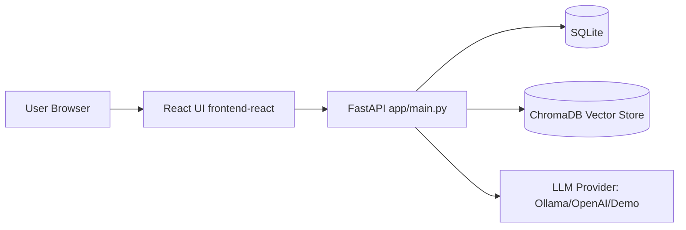

# AI-Powered Resource Management RAG App

This README describes the overall architecture of the project and links to module-specific documentation.

## Architecture Overview

The system is a full-stack application built around a FastAPI backend and a React frontend.

1. The browser UI is served from the built React app in `frontend-react/dist`.
2. The FastAPI backend exposes REST APIs under `/api/v1/*`.
3. Data is stored in SQLite via SQLAlchemy models and route layers.
4. Semantic retrieval is handled by a ChromaDB vector store.
5. Response generation is handled by an LLM provider (`ollama`, `openai`, or `demo`).



## Repository Structure

- `backend/`: FastAPI backend package (`app/`), tests, dependencies, and backend entrypoint
- `frontend-react/`: React + Vite frontend source
- `scripts/`: Utility scripts (including one-command startup)
- `.env` / `.env.example`: Runtime configuration

## Documentation Split

- Backend setup and API documentation: `backend/README.md`
- Frontend setup and development workflow: `frontend-react/README.md`

## Quick Start (All Services)

Use the startup script:

```powershell
powershell -NoProfile -ExecutionPolicy Bypass -File .\scripts\start-all.ps1 -FrontendMode dev
```

This validates Ollama, ensures model availability, starts FastAPI, and starts the React dev server.
```

> **Windows users:** Use `py -m pytest tests/ -v`

---

## Project Structure

```
.
├── app/
│   ├── main.py              # FastAPI app: lifespan, CORS, route registration, static files
│   ├── config.py            # Pydantic Settings (reads from .env)
│   ├── database.py          # SQLAlchemy engine, session, Base, create_tables()
│   ├── models/
│   │   ├── resource.py      # Resource (employee) SQLAlchemy ORM model
│   │   ├── project.py       # Project ORM model + ProjectStatus enum
│   │   └── allocation.py    # Allocation ORM model (resource ↔ project)
│   ├── routes/
│   │   ├── schemas.py       # Pydantic request/response schemas for Resources
│   │   ├── resources.py     # Resource CRUD + allocate/release endpoints
│   │   ├── projects.py      # Project CRUD + team endpoint
│   │   ├── allocations.py   # Allocation CRUD endpoints
│   │   ├── rag.py           # RAG query, recommend, and semantic search endpoints
│   │   ├── dashboard.py     # Stats, bench-aging, project-gaps analytics
│   │   └── admin.py         # Seed, reindex, health, clear endpoints
│   ├── services/
│   │   ├── vector_store.py  # ChromaDB + sentence-transformers (lazy init, graceful fallback)
│   │   └── rag_service.py   # RAG pipeline: retrieval → context → LLM (OpenAI/Ollama/demo)
│   └── data/
│       └── sample_data.py   # 15 sample resources, 6 projects, 6 allocations
├── frontend-react/          # React 19 + Vite frontend
│   ├── src/                 # React source components
│   ├── dist/                # Built output (served by FastAPI at /)
│   └── package.json
├── frontend/                # Legacy plain HTML/CSS/JS frontend (fallback)
│   ├── index.html
│   ├── style.css
│   └── app.js
├── tests/
│   ├── conftest.py          # In-memory SQLite fixtures, TestClient setup
│   ├── test_resources.py    # 13 resource endpoint tests
│   ├── test_projects.py     # 9 project endpoint tests
│   ├── test_allocations.py  # 8 allocation endpoint tests
│   └── test_dashboard.py    # 9 dashboard/analytics tests
├── run.py                   # uvicorn entry point (reads host/port from settings)
├── requirements.txt         # Python dependencies (minimum version pins)
├── .env.example             # Template for environment configuration
└── README.md
```

---

## How RAG Works

```
User Query
    │
    ▼
[1] Embed query using sentence-transformers (all-MiniLM-L6-v2)
    │
    ▼
[2] ChromaDB semantic search → top-N matching resource/project documents
    │
    ▼
[3] Build context string from retrieved documents
    │
    ▼
[4] Send context + question to LLM (OpenAI / Ollama / demo formatter)
    │
    ▼
[5] Return structured answer with sources and relevance scores
```

- **Indexing**: Resources and projects are embedded via `to_document_string()` on create/update and stored in ChromaDB. Use `/api/v1/admin/reindex` to rebuild.
- **Retrieval**: Cosine similarity search returns the most semantically relevant entries.
- **Generation**: OpenAI or Ollama produces a natural language answer; demo mode formats the raw context.

---

## License

MIT

## Admin user:

Username: admin
Password: admin123
Normal user:

Username: user
Password: user123