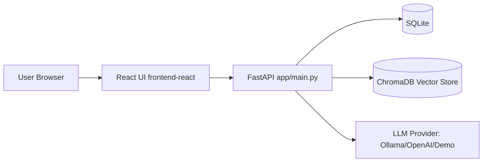

# AI-Powered Resource Management RAG App

This README describes the overall architecture of the project and links to module-specific documentation.

## Architecture Overview

The system is a full-stack application built around a FastAPI backend and a React frontend.

1. The browser UI is served from the built React app in `frontend-react/dist`.
2. The FastAPI backend exposes REST APIs under `/api/v1/*`.
3. Data is stored in SQLite via SQLAlchemy models and route layers.
4. Semantic retrieval is handled by a ChromaDB vector store.
5. Response generation is handled by an LLM provider (`ollama`, `openai`, or `demo`).


```mermaid
flowchart LR
  U[User Browser] --> FE[React UI frontend-react]
  FE --> API[FastAPI app/main.py]
  API --> DB[(SQLite)]
  API --> VS[(ChromaDB Vector Store)]
  API --> LLM[LLM Provider: Ollama/OpenAI/Demo]
```

## Repository Structure

- `backend/`: FastAPI backend package (`app/`), tests, dependencies, and backend entrypoint
- `frontend-react/`: React + Vite frontend source
- `scripts/`: Utility scripts (including one-command startup)
- `.env` / `.env.example`: Runtime configuration

## Documentation Split

- Backend setup and API documentation: `backend/README.md`
- Frontend setup and development workflow: `frontend-react/README.md`

## Quick Start (All Services)

Use the startup script:

```powershell
powershell -NoProfile -ExecutionPolicy Bypass -File .\scripts\start-all.ps1 -FrontendMode dev
```

This validates Ollama, ensures model availability, starts FastAPI, and starts the React dev server.
```

> **Windows users:** Use `py -m pytest tests/ -v`

---

## Project Structure

```
.
├── app/
│   ├── main.py              # FastAPI app: lifespan, CORS, route registration, static files
│   ├── config.py            # Pydantic Settings (reads from .env)
│   ├── database.py          # SQLAlchemy engine, session, Base, create_tables()
│   ├── models/
│   │   ├── resource.py      # Resource (employee) SQLAlchemy ORM model
│   │   ├── project.py       # Project ORM model + ProjectStatus enum
│   │   └── allocation.py    # Allocation ORM model (resource ↔ project)
│   ├── routes/
│   │   ├── schemas.py       # Pydantic request/response schemas for Resources
│   │   ├── resources.py     # Resource CRUD + allocate/release endpoints
│   │   ├── projects.py      # Project CRUD + team endpoint
│   │   ├── allocations.py   # Allocation CRUD endpoints
│   │   ├── rag.py           # RAG query, recommend, and semantic search endpoints
│   │   ├── dashboard.py     # Stats, bench-aging, project-gaps analytics
│   │   └── admin.py         # Seed, reindex, health, clear endpoints
│   ├── services/
│   │   ├── vector_store.py  # ChromaDB + sentence-transformers (lazy init, graceful fallback)
│   │   └── rag_service.py   # RAG pipeline: retrieval → context → LLM (OpenAI/Ollama/demo)
│   └── data/
│       └── sample_data.py   # 15 sample resources, 6 projects, 6 allocations
├── frontend-react/          # React 19 + Vite frontend
│   ├── src/                 # React source components
│   ├── dist/                # Built output (served by FastAPI at /)
│   └── package.json
├── frontend/                # Legacy plain HTML/CSS/JS frontend (fallback)
│   ├── index.html
│   ├── style.css
│   └── app.js
├── tests/
│   ├── conftest.py          # In-memory SQLite fixtures, TestClient setup
│   ├── test_resources.py    # 13 resource endpoint tests
│   ├── test_projects.py     # 9 project endpoint tests
│   ├── test_allocations.py  # 8 allocation endpoint tests
│   └── test_dashboard.py    # 9 dashboard/analytics tests
├── run.py                   # uvicorn entry point (reads host/port from settings)
├── requirements.txt         # Python dependencies (minimum version pins)
├── .env.example             # Template for environment configuration
└── README.md
```

---

## How RAG Works

```
User Query
    │
    ▼
[1] Embed query using sentence-transformers (all-MiniLM-L6-v2)
    │
    ▼
[2] ChromaDB semantic search → top-N matching resource/project documents
    │
    ▼
[3] Build context string from retrieved documents
    │
    ▼
[4] Send context + question to LLM (OpenAI / Ollama / demo formatter)
    │
    ▼
[5] Return structured answer with sources and relevance scores
```

- **Indexing**: Resources and projects are embedded via `to_document_string()` on create/update and stored in ChromaDB. Use `/api/v1/admin/reindex` to rebuild.
- **Retrieval**: Cosine similarity search returns the most semantically relevant entries.
- **Generation**: OpenAI or Ollama produces a natural language answer; demo mode formats the raw context.

## Verified Implementation Notes

The following items in the project description are implemented in the current codebase:

- AI assistant chat for natural-language staffing and resource questions.
- Ranked resource recommendations with match scores and explanations.
- Bench filtering and resource availability filtering.
- Skill gap detection and upskilling suggestions in the phase pipeline.
- Certification-aware recommendation scoring.
- Project-history-aware recommendation scoring.
- Analytics dashboard metrics for total resources, bench count, bench percentage, allocations, department breakdown, and top skills.
- Bench-aging analytics and project-gap analytics.
- Context source retrieval with semantic scores shown in the UI.

The main retrieval stack uses ChromaDB for the live RAG service, while the phase-validation pipeline writes FAISS artifacts for its own step-by-step workflow.

## Presentation-Ready Summary

### Problem Statement
IT services organizations often struggle to place the right employees on the right projects because visibility into skills, certifications, availability, and project history is fragmented. That creates higher bench costs, slower staffing, manual matching effort, and weaker insight into future demand.

### Proposed Solution
This platform combines an AI assistant and analytics dashboard to support resource managers. The assistant accepts natural-language staffing requests and returns ranked employee recommendations with match scores and explanations. The dashboard shows utilization, bench status, skill demand, and project gaps so managers can make faster and better decisions.

### How RAG Retrieves Documents
1. A user submits a question or staffing request in the UI.
2. The backend converts the query into an embedding.
3. ChromaDB retrieves the top semantic matches from employee and project documents.
4. Metadata filters narrow results by type, bench status, and other conditions.
5. The retrieved documents are assembled into context for the LLM.
6. The LLM generates the final response, while the UI shows the source list and semantic scores.

### Example Output Format
Query: Find two available Java developers with AWS experience.

AI Response:
- ✓ Employee A - 91% Match
- ✓ Employee B - 88% Match

Reasoning:
- Skills match project requirements
- Availability confirmed
- Relevant project experience

### Verified Features in the Codebase
- AI-powered resource matching
- Conversational staffing assistant
- Bench management and availability filtering
- Skill gap identification and upskilling suggestions
- Certification matching
- Project history matching
- Resource utilization dashboard
- Bench analytics and project-gap analytics
- Explainable AI recommendations with context source scores

### Architecture Notes
- Live RAG service: ChromaDB + SentenceTransformer embeddings + LLM generation
- Transactional store: SQLite + SQLAlchemy models
- Phase validation pipeline: FAISS-based artifacts for stepwise verification
- Frontend: React-based browser UI for AI query, recommendations, and analytics


---

## License

MIT

## Admin user:

Username: admin
Password: admin123
Normal user:

Username: user
Password: user123